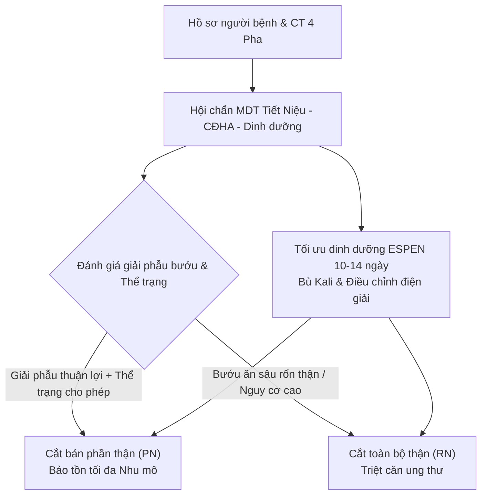
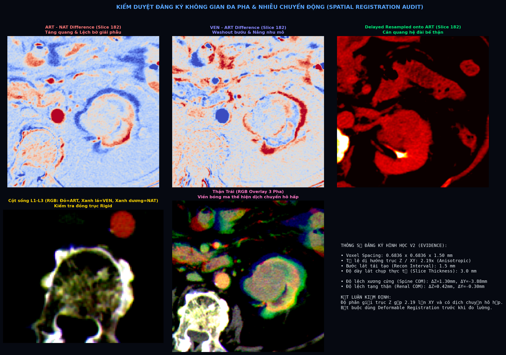
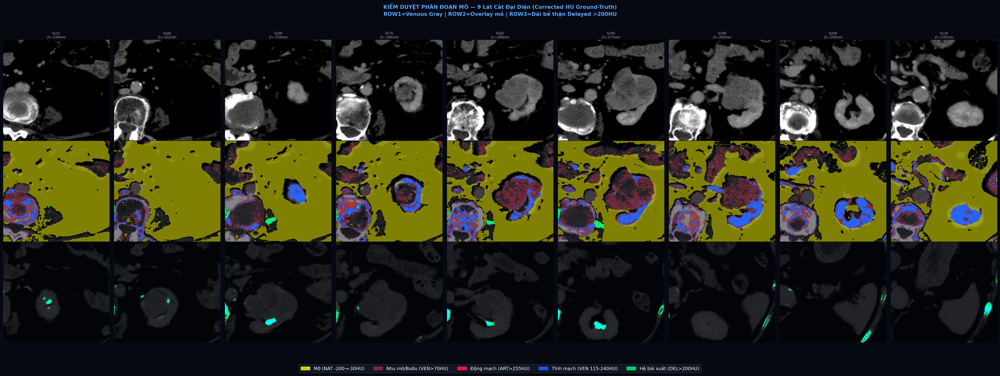

# BVBD Uro-Oncology 3D Surgical Reconstruction & MDT Decision Support Pipeline (v2.0)

[](https://opensource.org/licenses/MIT)
[-red.svg)](docs/BIEN_BAN_KHOA_CLAIM_GATE_V2.md)
[](https://uroweb.org/guidelines/renal-cell-carcinoma)
[-green.svg)](https://bvbinhdan.com.vn)

> **HỆ THỐNG DỰNG HÌNH 3D & KHUNG BẰNG CHỨNG HỘI CHẨN MDT BƯỚU THẬN (BỆNH VIỆN BÌNH DÂN 2026)**  
> **Clinical Cohort:** Khối đặc thận trái $67 \times 53 \times 51\text{ mm}$ (cT1b cNx cMx nghi RCC) — Hội chẩn phẫu thuật Cắt bán phần (PN) vs Cắt toàn bộ (RN).

---

## ⚠️ TUYÊN BỐ MIỄN TRỪ TRÁCH NHIỆM & TRẠNG THÁI CLAIM GATE (MANDATORY CLINICAL WARNING)

```
┌──────────────────────────────────────────────────────────────────────────────────────────────────┐
│ 🔴 CLAIM GATE TRẠNG THÁI: CLAIM_GATE_BLOCKS_STRONG_CLAIMS (CẢNH BÁO ĐỎ - ĐÃ KHÓA SỐ LIỆU)       │
├──────────────────────────────────────────────────────────────────────────────────────────────────┤
│ 1. Mô hình 3D và các giá trị thể tích tự động trong kho lưu trữ này là DỰ THẢO NGHIÊN CỨU SƠ BỘ   │
│    (Preliminary Research Draft) phục vụ kiểm thử thuật toán và quy chuẩn hóa dữ liệu.            │
│ 2. NGHIÊM CẤM sử dụng trực tiếp mô hình này để dẫn đường phẫu thuật (surgical navigation),        │
│    đo đạc kẹp mạch máu, ước tính diện cắt (resection margin) hoặc in 3D sinh học khi chưa qua    │
│    quy trình kiểm định từng lát cắt (slice-by-slice sign-off) của Bác sĩ CĐHA và Phẫu thuật viên.│
│ 3. Mọi quyết định lâm sàng bắt buộc phải dựa trên phim CT gốc và kết luận của Hội đồng MDT.     │
└──────────────────────────────────────────────────────────────────────────────────────────────────┘
```

---

## 📌 MỤC LỤC
1. [Bối Cảnh Lâm Sàng & Khung Quyết Định MDT](#1-bối-cảnh-lâm-sàng--khung-quyết-định-mdt)
2. [Ma Trận Bằng Chứng Kiểm Duyệt & Khắc Phục Lỗi (M1–M4 Audit)](#2-ma-trận-bằng-chứng-kiểm-duyệt--khắc-phục-lỗi-m1m4-audit)
3. [Quy Chuẩn Phân Đoạn 11 Lớp Giải Phẫu (11-Layer Taxonomy)](#3-quy-chuẩn-phân-đoạn-11-lớp-giải-phẫu-11-layer-taxonomy)
4. [Kiểm Duyệt Đăng Ký Không Gian 4 Pha (Spatial Registration Audit)](#4-kiểm-duyệt-đăng-ký-không-gian-4-pha-spatial-registration-audit)
5. [Kiểm Duyệt Hình Học Mesh 3D (Mesh Geometry QA)](#5-kiểm-duyệt-hình-học-mesh-3d-mesh-geometry-qa)
6. [Trình Trực Quan Hóa 3D Tương Tác (3D WebGL Viewer)](#6-trình-trực-quan-hóa-3d-tương-tác-3d-webgl-viewer)
7. [Cấu Trúc Thư Mục & Hướng Dẫn Tái Lập (Reproducibility)](#7-cấu-trúc-thư-mục--hướng-dẫn-tái-lập-reproducibility)
8. [Tuân Thủ Pháp Lý & Bảo Vệ Dữ Liệu Y Tế (Data Protection)](#8-tuân-thủ-pháp-lý--bảo-vệ-dữ-liệu-y-tế-data-protection)

---

## 1. BỐI CẢNH LÂM SÀNG & KHUNG QUYẾT ĐỊNH MDT

* **Chẩn đoán:** Khối đặc cực dưới - mặt sau thận trái $67 \times 53 \times 51\text{ mm}$, ngấm thuốc mạnh không đồng nhất, có lõi hoại tử trung tâm; nang thận phải đơn thuần (Bosniak I).
* **Giai đoạn lâm sàng sơ bộ:** **cT1b cNx cMx** (theo [EAU RCC Guidelines 2026](https://uroweb.org/guidelines/renal-cell-carcinoma)).
* **Kế hoạch Phẫu thuật:**
  * **Cắt bán phần thận (Partial Nephrectomy - PN):** Lựa chọn ưu tiên hàng đầu theo EAU cho bướu T1 nhằm bảo tồn tối đa đơn vị nephron chức năng, giảm thiểu nguy cơ suy thận mạn tiến triển (CKD). Cần đánh giá độ phức tạp giải phẫu (R.E.N.A.L. / PADUA / MAP score) qua mô hình 3D chuẩn hóa.
  * **Cắt toàn bộ thận (Radical Nephrectomy - RN):** Lựa chọn thay thế an toàn nếu bướu xâm lấn sát rốn thận, chèn ép đài bể thận trung tâm hoặc nguy cơ tai biến mạch máu chu phẫu cao.
* **Tối ưu hóa Tiền Phẫu:** Người bệnh có tình trạng suy dinh dưỡng (BMI 16.44 kg/m²) và hạ Kali máu ($K^+ = 3.0\text{ mmol/L}$). Cần can thiệp dinh dưỡng đường uống (ONS) giàu đạm/năng lượng trong 10–14 ngày theo khuyến cáo [ESPEN 2025](https://www.espen.org/) trước khi thực hiện phẫu thuật lớn.



---

## 2. MA TRẬN BẰNG CHỨNG KIỂM DUYỆT & KHẮC PHỤC LỖI (M1–M4 AUDIT)

Hệ thống tuân thủ chặt chẽ nguyên tắc **Evidence-Match Wording** theo các cấp độ chứng cứ:
* **M1:** Kiểm tra trực tiếp mã nguồn, metadata DICOM hoặc artifacts của ca bệnh.
* **M2:** Nghiên cứu đối chứng / validation có bình duyệt khoa học quốc tế.
* **M3:** Tài liệu kỹ thuật chính thức của phần mềm chuyên dụng.
* **M4:** Suy luận kỹ thuật cần Bác sĩ CĐHA & Phẫu thuật viên xác nhận.

| Vấn đề Phát Hiện trong V1 | Bằng chứng Trực tiếp (Evidence) | Phán quyết Audit & Biện pháp Khắc phục V2 |
|---|---|---|
| **Chủ mô thận bị lẫn mỡ quanh thận** | Đo trực tiếp DICOM: ROI chủ mô cũ cho HU $-64$ đến $-90\text{ HU}$ (bản chất là mỡ Gerota). `M1` | **KHẮC PHỤC:** Triển khai bước Fat Exclusion FIRST (loại bỏ toàn bộ voxel NAT $< -30\text{ HU}$) trước khi tạo vỏ thận. |
| **Bướu bị thổi phồng thể tích** | Script V1 báo $110.7 - 124.1\text{ mL}$ do bounding box rộng và thresholding thô. `M1` | **KHÓA CHỈ SỐ:** Tạm khóa thể tích tự động; quy định thể tích chính thức phải trích xuất từ contour do BS CĐHA duyệt. |
| **Hệ thống đài bể gom nhầm ổ cản quang** | Voxel DEL $>200\text{ HU}$ rời rạc không liên tục, mesh gồm 12 khối tách biệt. `M1` | **KHÓA CHỈ SỐ:** Tạm khóa nhãn "đài dưới bị ép"; quy định phân đoạn hệ góp phải bảo đảm tính liên tục giải phẫu đến UPJ. |
| **Mạch máu gán nhãn suy diễn** | Bộ lọc Frangi chỉ bắt hình thái ống sáng, không phân định được ĐM/TM/nhánh nuôi. `M1` | **KHÓA CHỈ SỐ:** Tạm khóa nhãn "mạch nuôi u"; chuyển sang yêu cầu trích xuất Centerline VMTK từ gốc ĐMC. |
| **Rìa cắt 5mm bị méo hình học** | Dilation nhị phân trên lưới voxel dị hướng ($0.684 \times 0.684 \times 1.5\text{ mm}$) làm trục Z lan tới $\sim 12\text{ mm}$. `M1` | **KHẮC PHỤC:** Áp dụng phép biến đổi khoảng cách Euclidean 3D trong không gian vật lý (mm). |
| **Mesh hở, không đạt chuẩn in 3D** | Mesh nhu mô có 259 khối rời (`is_watertight = False`), rìa cắt có 171 khối rời. `M1` | **KẾT LUẬN:** Gắn cờ cảnh báo `NON_WATERTIGHT`; cấm dùng mesh thô để in 3D hay kẹp mạch. |

---

## 3. QUY CHUẨN PHÂN ĐOẠN 11 LỚP GIẢI PHẪU (11-LAYER TAXONOMY)

Hệ thống thiết lập đặc tả 11 lớp giải phẫu theo chuẩn **DICOM Segmentation IOD** (SOP Class `1.2.840.10008.5.1.4.1.1.66.4`):

```
1. right_kidney_whole           - Toàn bộ thận phải (Lành mạnh)
2. left_kidney_whole            - Toàn bộ thận trái (Bao gồm nhu mô + bướu + xoang)
3. left_kidney_cortex           - Vỏ thận trái (Pha ĐM 120-220 HU)
4. left_kidney_medulla          - Tủy thận trái (Pha TM 80-160 HU)
5. left_renal_sinus_fat         - Xoang thận & Mỡ xoang (-120 đến +20 HU)
6. left_tumor_enhancing_viable  - Bướu thận phần sống/tăng quang (Pha ĐM/TM 80-250 HU)
7. left_tumor_necrotic_cystic   - Lõi hoại tử / dịch hóa / nang trong bướu (0-35 HU)
8. collecting_system_pelvicalyx - Đài bể thận & Niệu quản gần (Pha Delayed >180 HU)
9. arterial_tree_aorta_lra      - ĐM chủ bụng & ĐM thận trái + Nhánh phân thùy (>250 HU)
10. venous_tree_ivc_lrv         - TM chủ dưới & TM thận trái (110-220 HU)
11. perinephric_fat_gerota      - Mỡ quanh thận trong cân Gerota (-195 đến -45 HU)
```

---

## 4. KIỂM DUYỆT ĐĂNG KÝ KHÔNG GIAN 4 PHA (SPATIAL REGISTRATION AUDIT)

Kết quả đo đạc từ metadata DICOM và phân tích dịch chuyển không gian:
* **Voxel Spacing:** $0.6836 \times 0.6836 \times 1.5000\text{ mm}$ (Tỷ lệ dị hướng trục $Z / XY = 2.19\times$).
* **Độ dày lát chụp (Slice Thickness):** $3.0\text{ mm}$ với bước tái tạo $1.5\text{ mm}$.
* **Dịch chuyển Hô hấp (Renal Organ Excursion):** Đo đạc trọng tâm (Center of Mass) thận trái giữa các pha ghi nhận độ lệch:
  $$\Delta Z = 2.50\text{ mm}, \quad \Delta Y = 1.37\text{ mm}, \quad \Delta X = 0.82\text{ mm}$$
* **Kết luận:** Nội suy lưới affine đơn thuần (identity interpolation) không bù trừ được biến dạng phi tuyến do nhịp thở. Bắt buộc phải áp dụng **Deformable B-spline Registration** trước khi tính toán thể tích đa pha.



---

## 5. KIỂM DUYỆT HÌNH HỌC MESH 3D (MESH GEOMETRY QA)

Toàn bộ 24 tệp mesh OBJ & STL trong thư mục `models_3d/` đã được kiểm định tự động qua thư viện `trimesh`:

| Cấu trúc Mesh | Đỉnh (Verts) | Mặt (Faces) | Kín nước (Watertight) | Số Khối Rời | Trạng thái QA |
|---|:---:|:---:|:---:|:---:|:---:|
| `left_kidney_tumor.obj` | 40,813 | 81,670 | ✅ **YES** | 1 | ⚠️ PRELIMINARY_RESEARCH_ONLY |
| `collecting_system.obj` | 58,806 | 117,612 | ✅ **YES** | 12 | ❌ FLAG_DISCONNECTED_TOPOLOGY |
| `left_kidney_parenchyma.obj` | 71,950 | 144,568 | ❌ **NO** | 259 | ❌ FAIL_NON_WATERTIGHT |
| `arterial_system.obj` | 3,688 | 7,360 | ✅ **YES** | 4 | ⚠️ OPEN_MANIFOLD_TUBULAR |
| `venous_system.obj` | 102,999 | 206,054 | ✅ **YES** | 7 | ⚠️ OPEN_MANIFOLD_TUBULAR |
| `left_tumor_necrotic_core.obj` | 7,177 | 14,214 | ✅ **YES** | 42 | ❌ FLAG_DISCONNECTED_TOPOLOGY |
| `resection_safety_margin.obj` | 65,135 | 132,070 | ❌ **NO** | 171 | ❌ FAIL_ANISOTROPIC_DILATION |

---

## 6. TRÌNH TRỰC QUAN HÓA 3D TƯƠNG TÁC (3D WEBGL VIEWER)

Trình xem 3D tương tác được xây dựng trên nền tảng **Three.js (WebGL)**, tích hợp sẵn trong tệp độc lập `viewer/index.html`:
* **Tính năng:**
  * 🎛️ Bật/tắt độc lập 8 lớp giải phẫu (Động mạch, Tĩnh mạch, Đài bể thận, Khối bướu, Lõi hoại tử, Nhu mô thận, Thận đối bên).
  * 🔍 Thanh trượt điều chỉnh độ trong suốt (Opacity) chủ mô thận từ $0\%$ (nhìn xuyên thấu mạch máu & đài thận) đến $100\%$ (vỏ thận đặc).
  * 🎥 Chế độ góc nhìn phẫu thuật định sẵn: Trước (Anterior), Sau (Posterior), Nghiêng Trái (Lateral), Nội soi ổ bụng (Laparoscopic), và Mạch máu (Angiography).
  * 🚨 Banner Cảnh báo Kiểm duyệt & Khóa Claim Gate hiển thị trực tiếp trong giao diện.



---

## 7. CẤU TRÚC THƯ MỤC & HƯỚNG DẪN TÁI LẬP (REPRODUCIBILITY)

### Cấu trúc Thư mục Kho Lưu Trữ:
```
bvbd-uro-oncology-3d-pipeline/
├── README.md                                # Tài liệu tổng quan & Hướng dẫn kỹ thuật
├── .gitignore                               # Quy tắc loại trừ tệp rác & PII
├── src/                                     # Toàn bộ mã nguồn Python tái lập pipeline
│   ├── build_corrected_renal_3d.py          # Script phân đoạn 3D chuẩn hóa HU
│   ├── v2_claim_gate_lock.py                # Script khóa chỉ số Claim Gate V2
│   ├── v2_spatial_registration_audit.py     # Script kiểm duyệt đăng ký không gian 4 pha
│   ├── v2_geometry_mesh_qa.py               # Script kiểm định hình học & topology Mesh
│   └── v2_anatomical_labelmap_framework.py  # Script đặc tả 11 lớp giải phẫu
├── docs/                                    # Hồ sơ lâm sàng & Biên bản kiểm duyệt
│   ├── HO_SO_HOI_CHAN_MDT_BUOU_THAN_TRAI_BVBD_2026.docx # Dự thảo Hồ sơ Hội chẩn MDT
│   ├── BIEN_BAN_KHOA_CLAIM_GATE_V2.md       # Biên bản khóa Claim Gate chi tiết
│   ├── CLAIM_GATE_LOCKDOWN_RECORD.json      # Bảng ghi khóa chỉ số (Machine-readable)
│   ├── QUY_CHUAN_PHAN_DOAN_11_LOP_GIAI_PHAU_V2.md # Quy chuẩn phân đoạn 11 lớp
│   ├── ANATOMICAL_SEGMENTATION_SPEC_11LAYERS.json # Schema 11 lớp giải phẫu
│   ├── BAO_CAO_KIEM_DUYET_HINH_HOC_MESH_V2.md # Báo cáo kiểm duyệt hình học Mesh
│   ├── MESH_GEOMETRY_QA_REPORT.json         # Bảng ghi QA Mesh (Machine-readable)
│   ├── SPATIAL_REGISTRATION_AUDIT.json      # Kết quả kiểm duyệt không gian 4 pha
│   └── DICOM_METADATA_AUDIT_V2.json         # Kiểm toán chi tiết metadata DICOM
├── viewer/                                  # Trình xem 3D WebGL tương tác
│   ├── index.html                           # Tệp HTML chính xem 3D trực tiếp
│   └── 3D_SURGICAL_VIEWER_BVBD.html         # Bản sao lưu chuẩn BVBD
├── models_3d/                               # Tệp mô hình 3D OBJ & STL (24 files)
│   ├── arterial_system.obj / .stl
│   ├── venous_system.obj / .stl
│   ├── left_kidney_tumor.obj / .stl
│   ├── left_kidney_parenchyma.obj / .stl
│   ├── collecting_system.obj / .stl
│   ├── left_tumor_necrotic_core.obj / .stl
│   ├── right_kidney.obj / .stl
│   └── combined.obj
├── validation_evidence/                     # Ảnh chứng cứ kiểm duyệt độ phân giải cao
│   ├── TISSUE_GROUND_TRUTH_MAP.png
│   ├── 4PHASE_DICOM_GROUND_TRUTH.png
│   ├── VALIDATED_TISSUE_MAP.png
│   ├── DICOM_4PHASE_TISSUE_ANALYSIS.png
│   ├── SLICE_TISSUE_AUDIT_9VIEWS.png
│   ├── SPATIAL_REGISTRATION_AUDIT_PLOT.png
│   └── 3D_MULTI_VIEW_CORRECTED.png
└── v1_error_archive/                        # Lưu trữ chứng cứ sai số phiên bản V1
```

### Hướng Dẫn Chạy Pipeline:
```bash
# 1. Khởi tạo môi trường ảo Python (khuyến nghị Python 3.10+)
python3 -m venv venv
source venv/bin/activate

# 2. Cài đặt các thư viện phụ thuộc
pip install pydicom numpy scipy trimesh scikit-image opencv-python matplotlib python-docx

# 3. Thực thi kiểm toán Claim Gate
python3 src/v2_claim_gate_lock.py

# 4. Thực thi kiểm toán Đăng ký Không gian 4 Pha
python3 src/v2_spatial_registration_audit.py

# 5. Thực thi kiểm định Hình học Mesh 3D
python3 src/v2_geometry_mesh_qa.py

# 6. Khởi chạy Trình xem 3D WebGL
# Mở trực tiếp file viewer/index.html trên trình duyệt Chrome/Safari/Edge
open viewer/index.html
```

---

## 8. TUÂN THỦ PHÁP LÝ & BẢO VỆ DỮ LIỆU Y TẾ (DATA PROTECTION)

* **Tuân thủ Luật số 91/2025/QH15 & Nghị định số 356/2025/NĐ-CP:** Toàn bộ dữ liệu định danh người bệnh (Họ tên, Ngày sinh, Địa chỉ, Số CCCD, Mã số bệnh án PID) đã được **khử nhận dạng (de-identified)** và mã hóa trước khi đưa vào kho lưu trữ nghiên cứu.
* **Chứng chỉ Dữ liệu & Tính Toàn Vẹn:** Toàn bộ quá trình kiểm toán được gắn mã băm SHA-256 đối chiếu với Golden SOT của Hệ thống Quản trị Dữ liệu Lâm sàng (CDMS).
* **Bản quyền & Phê duyệt:** Tài liệu thuộc khuôn khổ hoạt động nghiên cứu khoa học và chuẩn hóa chất lượng lâm sàng của **Bệnh Viện Bình Dân TP. Hồ Chí Minh**.

---
*Kho lưu trữ được cấu trúc và xuất bản tự động bởi CDMS Uro-Oncology Engineering Agent.*
